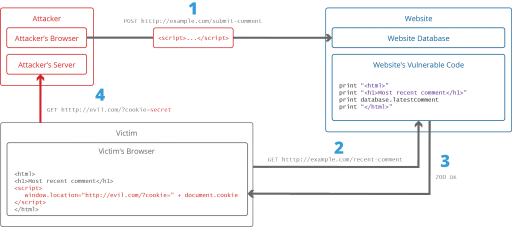

# XSSing-Android-Apps
A simple walkthrough of performing an XSS attack on Hybrid Android Applications

## Cross-site Scripting (XSS)
Cross-site scripting also widely known as XSS are a type of injection, where in
malicious codes are injected by an attacker into websites to steal data. Instead of
targeting the victim directly, the attacker exploits the vulnerability in a website or an app
in case of hybrid app, that the victim visits.
Usually these kind of attacks occur when the malicious code is sent in the form of a
browser side script, to a different user. XSS can exploit the vulnerabilities in various
technologies like VBScript, ActiveX and Flash (now not popular) and the widely used
and touted as a powerful language - JavaScript. JavaScript is widely used for web
development because it allows you to communicate with other Languages. Also, the
original purpose of Javascript was to provide dynamic and interactive content on
webpages. It achieves this by communicating with other languages, specifically HTML
and CSS3. And that’s the origin of many problems as you will see.

## How XSS works?
The primary and powerful approach of attack is injecting malicious JavaScript into one
of the pages in a website that a victim views/downloads. Easier way to attack would be
if the pages themselves contain input fields. And many a times, while development, the
developers miss exhaustive validation of a field or two. This one field can have the most
damaging effect on the website.
The attacker will insert a script, containing malicious code into one of these input fields
and the field will pass them as a string. Example of such strings are below:

```
<script>alert(document.cookie)</string>
<SCRIPT>alert("XSS")</SCRIPT>">
print "<html>"
print "Latest comment:"
print database.latestComment
print "</html>"
<html>
<h1> Most recent comment </h1>
<script> executeAMaliciousCode(); </script>
</html>
```

The script assumes that the contents consists of only text, but as you can see this can
be included directly in the page and anyone visiting the page will receive the web page
with additional javascript with it. See below diagram for an attack scenario.



Image credits: https://www.acunetix.com/websitesecurity/cross-site-scripting/


There are three types of XSS, and they are:

## Stored/Persistent XSS
In this case, the malicious string originates from a website’s database. And when a
victim gets hold of this page with the malicious content and renders it, the attacker gets
hold of user’s personal data.

## Reflected XSS
This type of attacks occur when user shares data with the website, like providing input
as part of a request. And in this case, website redirects the user to an error message.
Also, data may not be stored permanently and the user may end up seeing partial/full
request parameters as part of the response as a reflection.

## DOM Based XSS
In this case, the entire vulnerability onus is for the client-side code. And the server-side
code is not a culprit here. The entire flow of a webpage happens inside its major
component called as DOM (Document Object Model). So, the data is held within the
browser the entire time. Methods such as document.write, appendChild(),
document.cookie etc are inserted into the malicious code and executed when the
source URL is read. And this can lead to cookie stealing, session hijacking etc.
